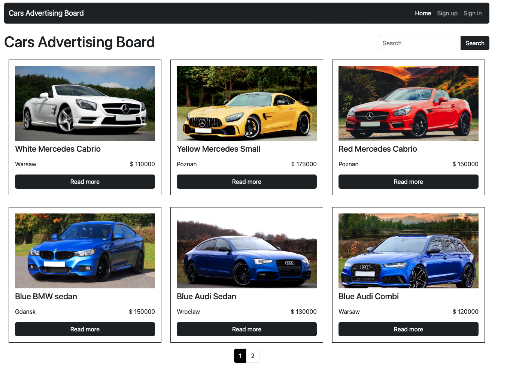
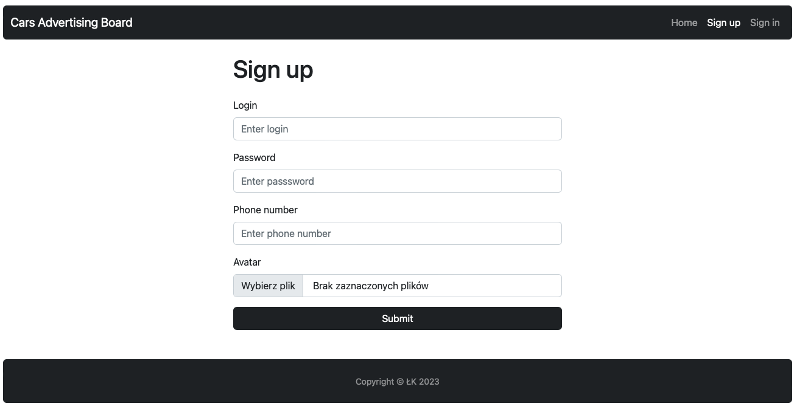
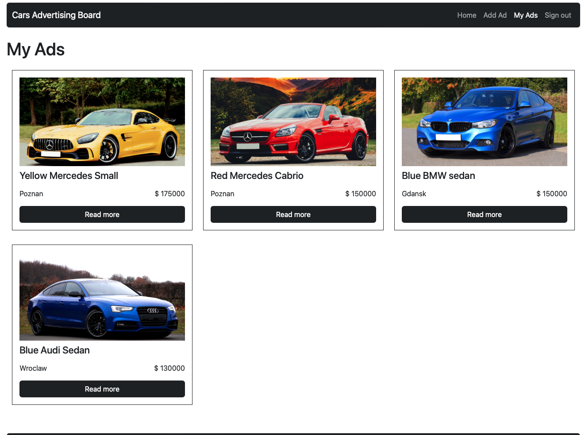
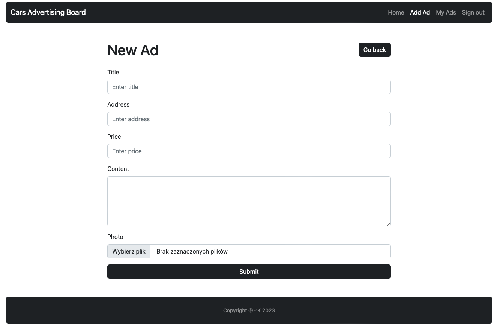
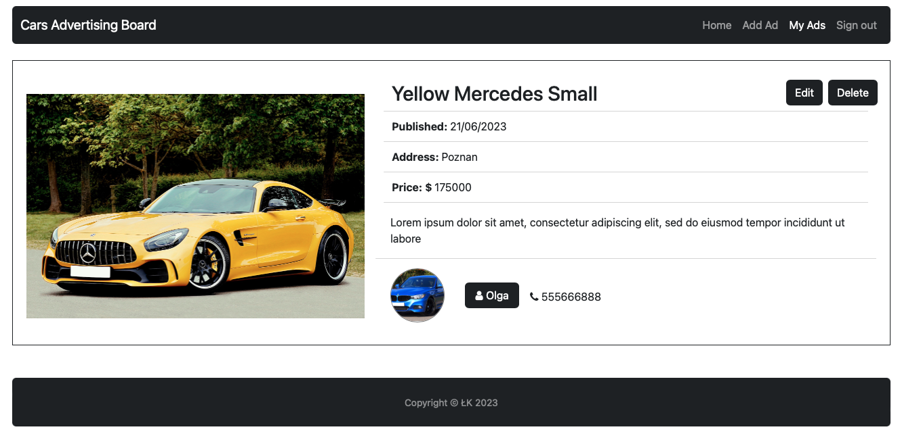
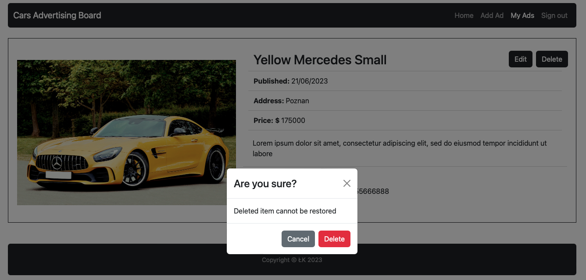
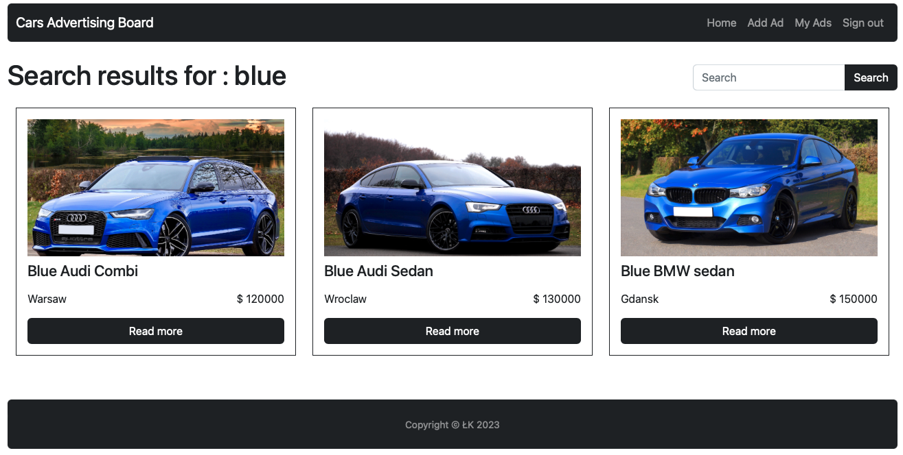

# Cars Ads Board

A full-stack CRUD app that enables users to add cars ads. The backend is built using NodeJS, Express and MongdDBAtlas, while the frontend is built in React.

## [Live Demo](https://cars-ads-board-full-stack-app.onrender.com)

## Technologies

- Node JS
- Express
- MongoDB with `mongoose
- React

## Overview

Cars Ads Board app features:

- General
  - Fetch users (hashed password) and ads data from MongoDB Atlas
  - User registration and login funcionality
  - Persistent user session
  - Displays a list of all ads
  - Displays a list of ads by a particular user
  - RWD styles
  - Search funcionality by ad title  
    &nbsp;
- For logged-in users:
  - Ability to add car ads
  - Ability to edit or delete their own ads
  - Display a list of the user's ads

## Screenshots

### Home

  
 &nbsp;

### Sing up

  
 &nbsp;

### My ads

  
 &nbsp;

### Ad form

  
 &nbsp;

### Ad page

  
 &nbsp;

### Ad delete

  
 &nbsp;

### Search

  
 &nbsp;
